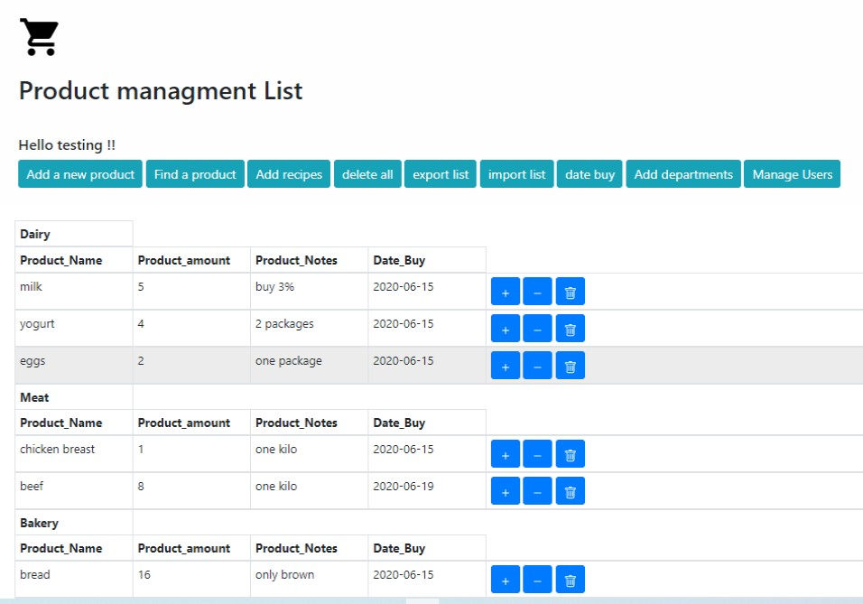

# Groceries Shopping List

# Goal

The main goal of the app is: manage groceries efficiently and easily.
#Description
The app enables to create an organized product list , displayed by categories . Using categories will achieve the objective of saving time through store and online store. The app enables you to easily add products .It is also  very convenient to delete a product as well as delete all products entered .The app enables to reuse a list, which allows to save time inputting groceries. In fact, all lists can be saved to an excel file.Each sheet is represented by the date of shopping. So the user can import the list which is most relevant for him. 
Another feature is updating the groceries list according to a recipe(entered a head).It helps remember everything needed for planned cooking .which is a great benefit for managing your  groceries. 

# Prerequisites

Install MySQL Workbench 8.0

To have this app running on your local computer: Create and activate a virtual environment.
Install the dependencies:
Create database 'home_products_manager'

```
create_home_products_database.py
```

# Technologies
Backend: Python, Flask, MySQL, SQLAlchemy
Frontend: JavaScript,  Jinja2, HTML5, CSS, Bootstrap.
